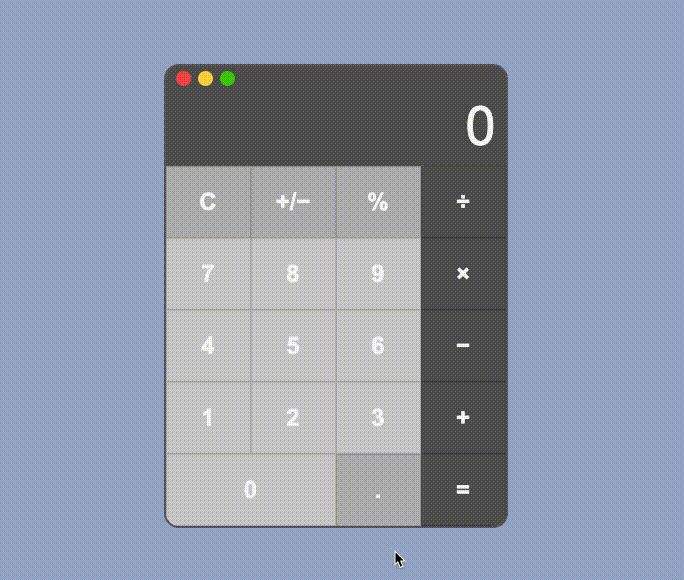
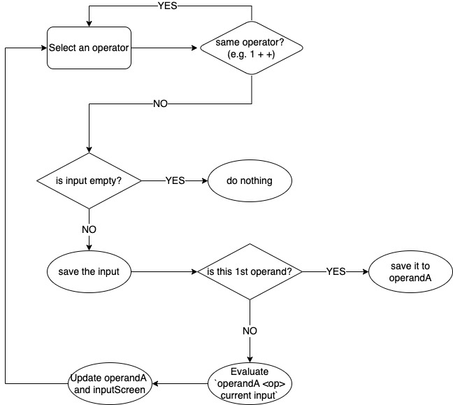

# MacOS Calculator

    
    
    
     

CodePen link - [Calculator UI](https://codepen.io/midotype/pen/WNdwgOj)

---

updated: 04-21-2022
- applied SMACSS architecture

---

## Issues 

I was struggling with saving the state of evaluated operands and the operator. 
When inputs are already there and you click on a different operator, it should 
evaluate `evaluated_value <operator> currentInput` and save the new operator.

I couldn't get my heads around this logic; I was so puzzled. 
So I tried making a flow diagram again and it helped me alot to get through it -- *this is 
just the initial diagram that some flows are quite different*. 

## What I learned
- I wanted to try to run the app on a `localhost` on a spceific port. There was a `http` library that I can use to create a simple server and let it listen to the port I assign -- ([server.js](./server.js))
- Speaking of `localhost`, I thought about sharing the demo of my app without hosting anywhere like netlify or heroku. There was a `ngrok` which basically turns your locally hosted project into some sharable link and let people view your app. I ended up not using it but it's still good to know about its existence :)
- Here's a big one. **TypeScript**! This was my first project using the TS and I can't believe why I haven't used TS until now. It helped me understand more about the data I'm actually using (e.g. HTMLElement, Event, NodeList, etc...) and it makes it easier to catch errors. I'm still struggling about when to specify types like e.g. "do I put `: void` on every functions not returning anything or leave it blank?" but I'll just try to read more codes.

---

## Extra

Some ideas to improve the calculator:
- maximize button (green) => scientific calculator mode
- minimize button (yellow) => simple calculator mode (default)
- display which operator is selected, or
- display the expression as it goes at the top of the input screen.
- Rounding issues (e.g. `0.1 + 0.2` => `0.3000000004`)